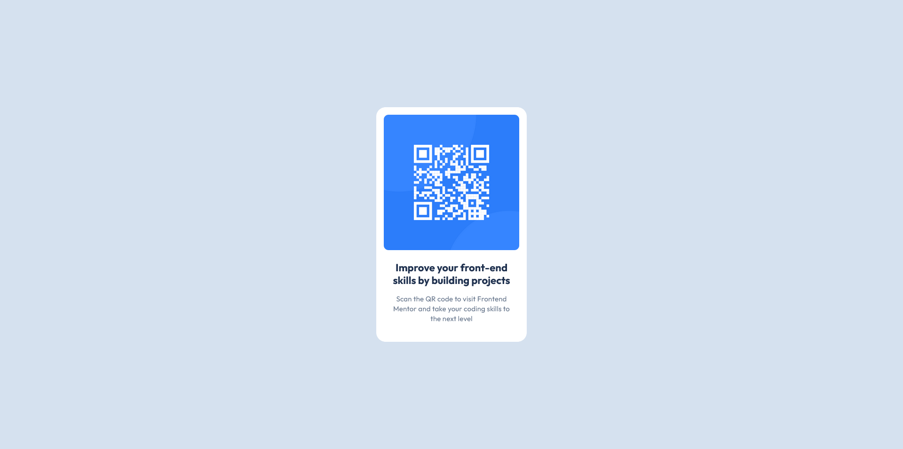

# Frontend Mentor - QR code component solution

This is a solution to the [QR code component challenge on Frontend Mentor](https://www.frontendmentor.io/challenges/qr-code-component-iux_sIO_H). Frontend Mentor challenges help you improve your coding skills by building realistic projects. 

## Table of contents

- [Overview](#overview)
  - [Screenshot](#screenshot)
  - [Links](#links)
- [My process](#my-process)
  - [Built with](#built-with)
  - [What I learned](#what-i-learned)
  - [Useful resources](#useful-resources)
- [Author](#author)

## Overview

I have built this small project to apply and solidify my knowledge on HTML and CSS basics.

### Screenshot



### Links

- Solution URL: https://www.frontendmentor.io/solutions/simple-qr-code-component-using-css-flexbox-and-custom-color-variables-_DKQHsMa2h
- Live Site URL: https://schindlerdumagat.github.io/qr-code-component/

## My process

First, I inspect the design file which helped me decide on the components of the project (HTML structure and Base CSS Styles).
Second, I implemented my HTML code I designed in my mind.
Third, I implemented my base CSS styles with custom variables that I knew I needed.
Fourth, I polished the project by adding more specific styles to some components.

### Built with

- HTML and CSS
- Semantic HTML5 markup
- CSS custom properties
- Flexbox

### What I learned

I was able to applying semantic HTML.
```html
<article>
    
    <div class="text-container">
      <h1>Improve your front-end skills by building projects</h1>
      <p>Scan the QR code to visit Frontend Mentor and take your coding skills to the next level</p>
    </div>
  </article>

```

I was able to create and use css custom variables.
```css
:root {
      --main-bg-color: #D5E1EF;
      --title-color: #1F314F;
      --desc-color: #68778D;
    }

background-color: var(--main-bg-color);
      width: 100vw;
      height: 100vh;
      display: flex;
      justify-content: center;
      align-items: center;
```

### Useful resources

- [CSS Variables](https://developer.mozilla.org/en-US/docs/Web/CSS/Using_CSS_custom_properties) - I have implemented CSS variables to setup my colors in one location and this resource helped me with that.

## Author

- Website - [Schindler C. Dumagat](https://schindlerdumagat.github.io/website-portfolio/)
- Frontend Mentor - [@schindlerdumagat](https://www.frontendmentor.io/profile/schindlerdumagat)
